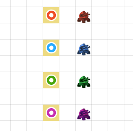
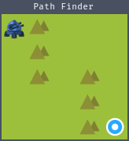
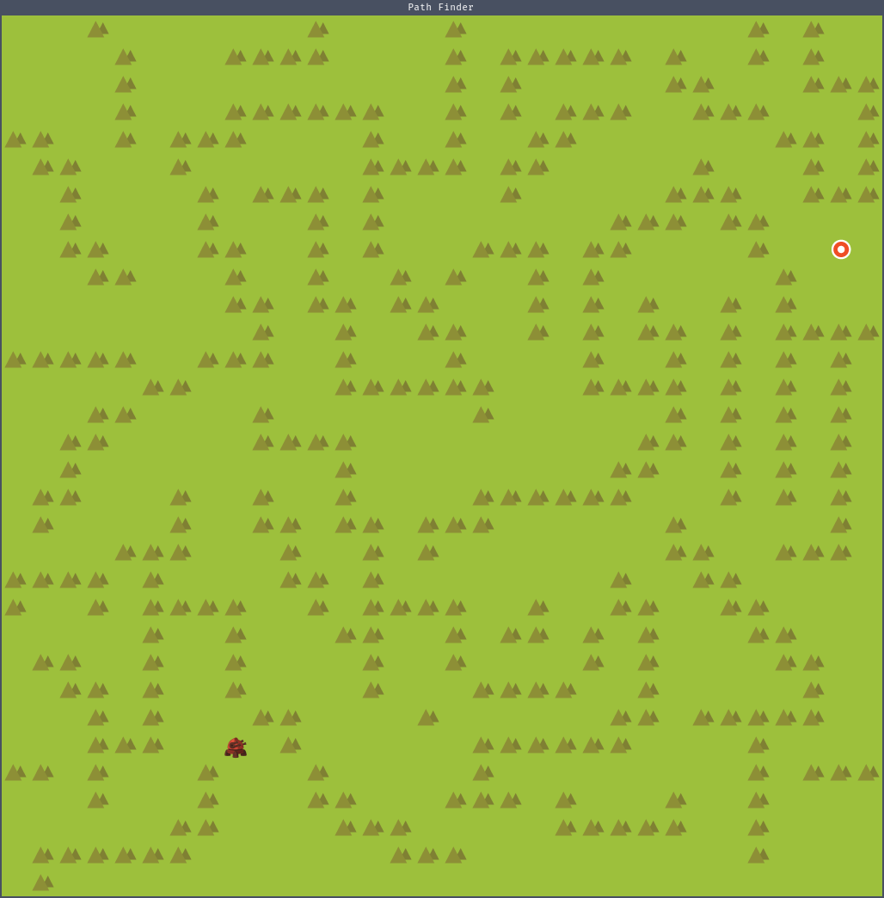
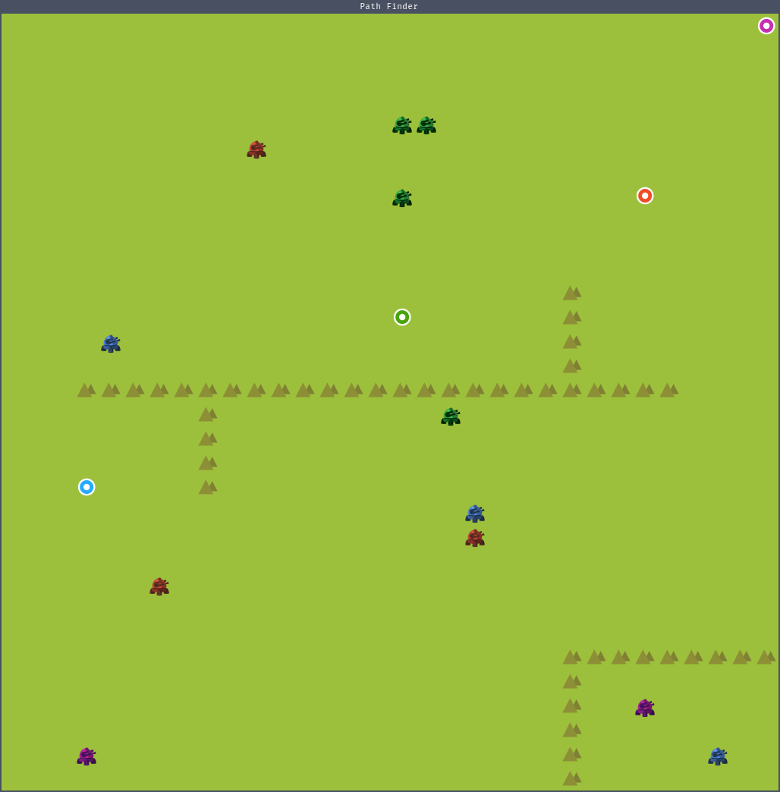

# PathFinder


This program parses a RiskyLab.com/tilemap compatible tilemap file and calculates
a path for a battle unit of a given color to the circular target of the same color.



## trace_path utility

The **trace_path** utility can be used to find the path for one or multiple
units to their target, and output the result to STDOUT in JSON format.

For example, this simple 5x5 map:



Yields the following output in JSON format:

```json
[
  {
    "unit": "0/0",
    "path": [
      "0/0",
      "0/1",
      "0/2",
      "0/3",
      "1/3",
      "2/3",
      "2/2",
      "2/1",
      "3/1",
      "4/1",
      "4/2",
      "4/3",
      "4/4"
    ]
  }
]
```

## animate_path utility



The **animate_path** utility graphically animates the path for one or more
units to their respecive target(s). The animation begins automatically and
can be (somewhat) controlled using these keys:

- **ESC** closes the window
- **P** pauses the animation
- **R** resets the units back to their starting positions

If multiple units would occupy the same space, units will yield to other units
(see green units in multi_path example). Units that have no target on the map
or cannot reach their target (see bottom right corner below) will not move.



## Algorithm

Dijksta's path finding algorithm is applied to the map and any unit of a given
color is matched to a target of the same color. A generic, priority queue based
implementation of the algorithm to determine the distance from any target to any
unit.

The A-star algorithm, which enhances Dijkstra's algorithm through the addition
of a cost function to narrow down the search space could be used to further
enhance performance.

## A note on RiskyLab.com tilemaps...

The tilemaps produced by the riskylab.com/tilemap online tile map editor use
a, well, _curious_ format for layer data.

The coordinates of the tile in the tilesheet are encoded in JSON as a floating
point number. The integer component denotes the "X" coordinate of the tile in
the tilesheet, while the fractional component denotes the "Y" coodinate of the
tile in the tilesheet. A value of "-1" denotes no tile at that position.

For example:
The value of "1.23" denotes a tile from the tilesheet at position x=1, y=23.

This causes a severe and easily reproducible bug:
A tile in a row divisible by 10 cannot be stored in the layer data.
In other words, the value of "2.1" and "2.10" are both parsed as x=2, y=1...
At this time (January 2025) this bug is inherent to the editor.

## Dependencies

### testrunner - Unit test framework

[https://github.com/int2str/testrunner](https://github.com/int2str/testrunner)

PathFinder uses my 'TestRunner' unit test framework for some simple unit tests.
In production, much more mature testing frameworks such as Google's gtest or
Catch2 are available.

### jsonlib - JSON file parser

[https://github.com/int2str/jsonlib](https://github.com/int2str/jsonlib)

To parse tile maps, my own 'jsonlib' library is used. As with 'TestRunner' above,
more mature (better, faster, stronger) JSON parsers (such as nlohmann/json) are
available. 'jsonlib', as with 'TestRunner' were created recreationally.

### libfmt - C++ formatting library

While std::print / std::println have finally landed with C++23, support is
still not universal on all platforms. For simplicity, this project used
libfmt for now.

### SFML - Simple and Fast Multimedia Library

This library is used for animating the path finding results and render the
tilemap sprites.

## Building and running

When cloning the repository, make sure to specify the **--recursive**
parameter to make sure the included submodules are cloned as well.

Example:

`git clone --recorsive https://github.com/int2str/PathFinder.git`

### Build dependencies

The code is built using the [ninja-build](https://ninja-build.org/) system,
using the clang++ compiler. A recent (clang-19 in 2025) version of
the clang toolchain is required since the code is relying on various
C++23 language features.

The code requires libfmt and libsfml to be available on the host machine.

On Ubuntu this can be achieved by installing these packages:

`sudo apt install libfmt-dev libsfml-dev`

### Running

Tests can be run using the following command:

`./build/pathfinder_tests -t`

The -t paramter displays optional timing information.
A tilemap path can be traced using the following command:

`./build/trace_path data/5x5.json`
